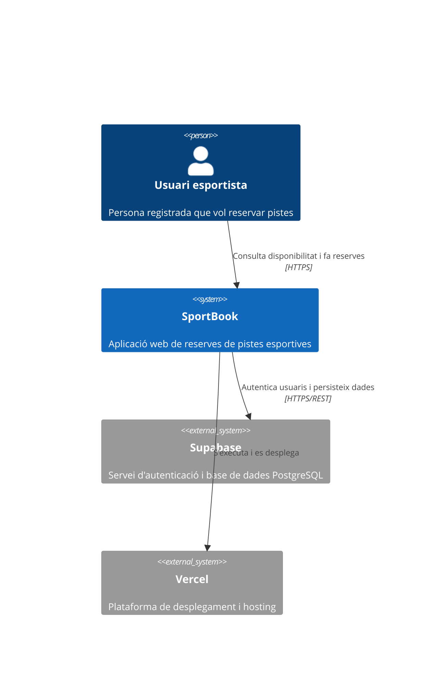
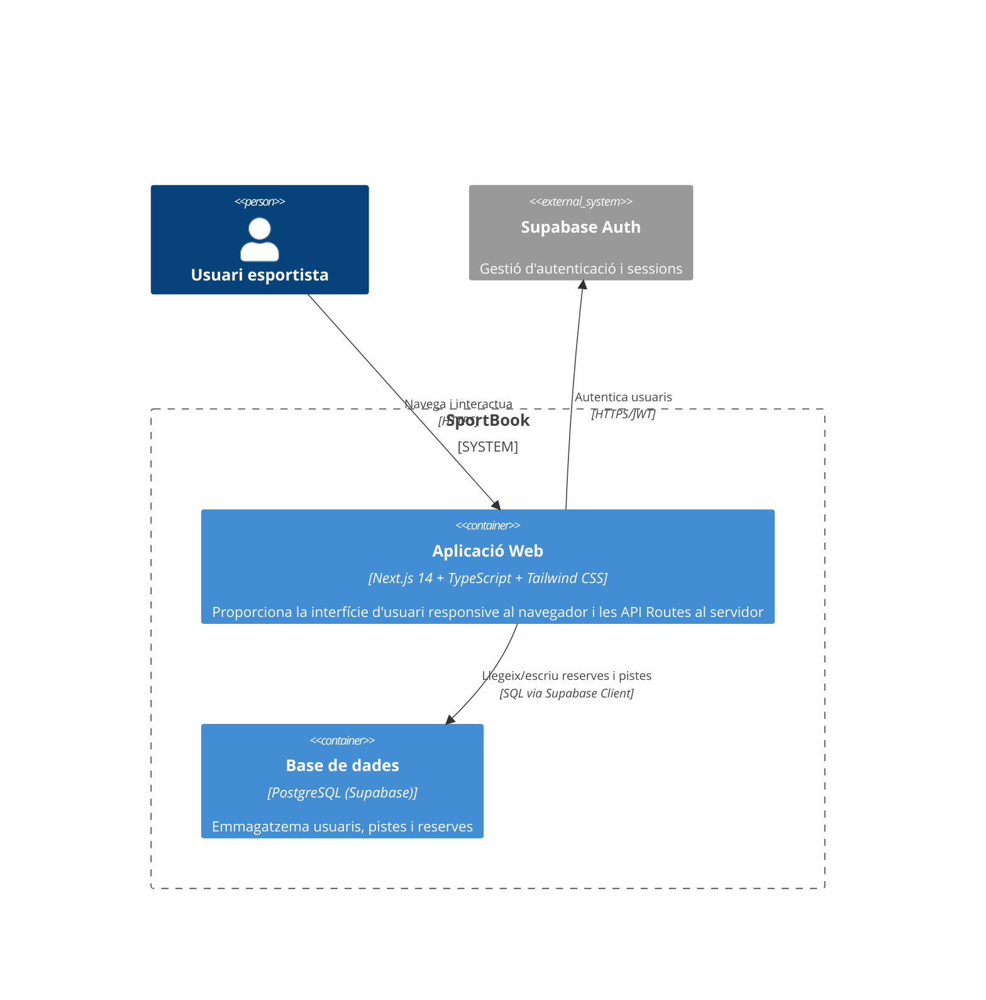
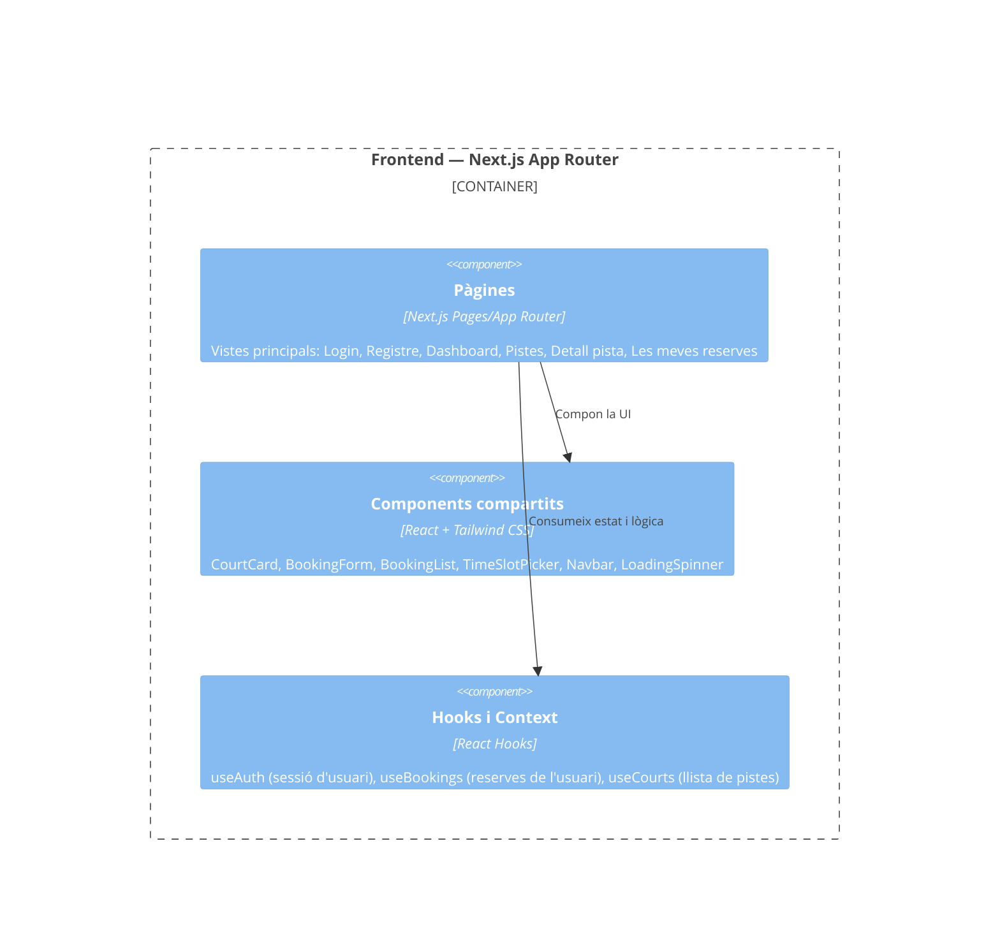
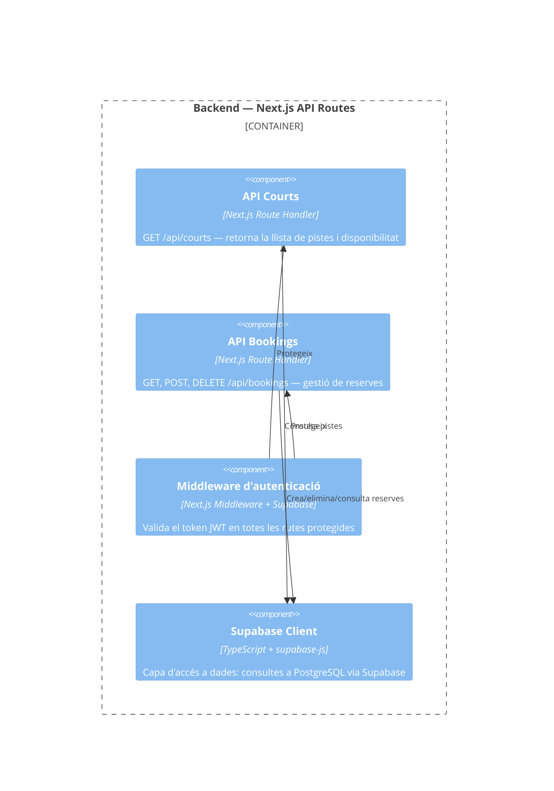
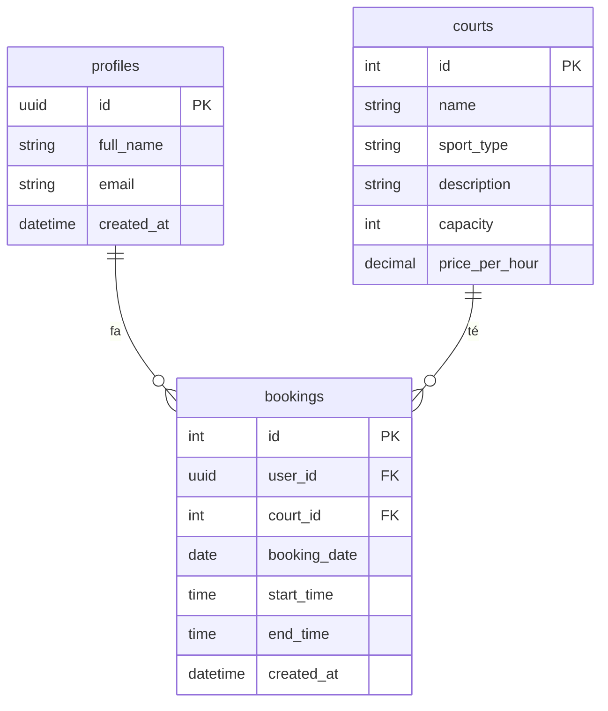

# Memòria del Projecte — SportBook

**Curs:** 2025-2026 — Laboratori de Projectes de Software - Convocatòria Extraordinària
**Data:** 5 de juliol de 2026

---

## 1. Equip i rols

| Membre | Rol principal | Rols secundaris | Dedicació |
|--------|---------------|-----------------|-----------|
| Alexander Cordero | Desenvolupador _back_ | — | 100% backend |
| Adrián Marzo | Desenvolupador _front_ | — | 100% frontend |
| Gaizka Medina | Desenvolupador _front_ | Desenvolupador _back_ | 50% frontend, 50% backend |
| Diego Trujillo | Gestor de projecte | Desenvolupador _front_ | 60% gestió, 40% frontend |
| Francesc Vinent | Desenvolupador _back_ | Gestor de projecte | 80% backend, 20% gestió |

---

## 2. Producte

### 2.1 Context i motivació

Els poliesportius i instal·lacions esportives gestionen les reserves de pistes de forma manual (telèfon, presencialment o per correu electrònic), cosa que genera ineficiències tant per als usuaris com per al personal del centre. L'usuari no pot consultar la disponibilitat en temps real ni reservar fora de l'horari d'atenció.

**SportBook** és una aplicació web que digitalitza aquest procés: permet als usuaris registrats consultar la disponibilitat de les pistes d'un poliesportiu i fer reserves en línia en qualsevol moment, des de qualsevol dispositiu.

### 2.2 Stakeholders

| Stakeholder | Expectatives |
|-------------|-------------|
| Usuari esportista | Consultar disponibilitat i reservar pistes de forma ràpida i autònoma, sense trucar ni desplaçar-se |
| Gestor del poliesportiu | Reduir la càrrega administrativa de gestió manual de reserves i tenir visibilitat sobre l'ocupació de les pistes |

### 2.3 Objectius

- **General:** Proporcionar una plataforma web responsive que permeti als usuaris reservar pistes esportives en línia de forma autònoma i en temps real.
- **Específics:**
  1. Permetre als usuaris registrar-se, autenticar-se i gestionar les seves reserves sense intervenció del personal del centre.
  2. Mostrar la disponibilitat real de les pistes per franges horàries, evitant solapaments de reserves.
  3. Oferir una interfície accessible des de mòbil i ordinador, minimitzant la fricció del procés de reserva.

### 2.4 Tipologia

- **Tipus:** Aplicació web responsive (SPA)
- **Eina de gestió:** GitHub Projects

---

## 3. Descomposició en user stories / casos d'ús

### 3.1 Llista de user stories

| ID | Nom | Descripció | Criteri d'acceptació |
|----|-----|------------|----------------------|
| US-01 | Registre d'usuari | Com a visitant, vull crear un compte amb email i contrasenya per tal de poder fer reserves | L'usuari rep un email de confirmació i pot iniciar sessió un cop verificat |
| US-02 | Login / Logout | Com a usuari registrat, vull iniciar i tancar sessió per tal d'accedir de forma segura a les meves dades | L'usuari autenticat accedeix al dashboard; en logout es destrueix la sessió |
| US-03 | Veure pistes i disponibilitat | Com a usuari registrat, vull veure totes les pistes del poliesportiu i els horaris disponibles per tal de saber quan puc reservar | Es mostren totes les pistes amb les franges horàries lliures i ocupades del dia seleccionat |
| US-04 | Fer una reserva | Com a usuari registrat, vull reservar una pista en una franja horària disponible per tal de garantir-me l'ús | La reserva es crea correctament, la franja passa a ocupada i l'usuari rep confirmació |
| US-05 | Veure les meves reserves | Com a usuari registrat, vull veure una llista de les meves reserves futures per tal de recordar quan he reservat | Es mostra la llista ordenada per data amb pista, data i hora de cada reserva |
| US-06 | Cancel·lar una reserva | Com a usuari registrat, vull cancel·lar una reserva futura per tal d'alliberar la pista si no la necessito | La reserva s'elimina, la franja torna a estar disponible i es mostra confirmació a l'usuari |
| US-07 | Filtrar pistes per esport | Com a usuari registrat, vull filtrar les pistes per tipus d'esport per tal de trobar ràpidament les pistes que m'interessen | En seleccionar un esport, només es mostren les pistes d'aquell tipus |
| US-08 | Confirmació per email | Com a usuari, vull rebre un email de confirmació en fer o cancel·lar una reserva per tal de tenir-ne constància | L'usuari rep un email automàtic amb els detalls de la reserva o la seva cancel·lació |
| US-09 | Valorar una pista | Com a usuari, vull valorar una pista després d'haver-la usat per tal d'ajudar altres usuaris a escollir | L'usuari pot deixar una puntuació (1-5) i comentari un cop passada la reserva; es mostra la mitjana a la pista |
| US-10 | Historial de reserves | Com a usuari, vull consultar les reserves passades per tal de portar un registre del meu ús del centre | Es mostra una llista de reserves ja finalitzades ordenada per data descendent |

### 3.2 Justificació de prioritats

Les user stories s'han prioritzat utilitzant el mètode MoSCoW:

- **Must have (US-01 a US-06):** Funcionalitats essencials per al funcionament del producte. Sense autenticació, visualització de disponibilitat, i operacions de reserva (crear i cancel·lar), el producte no té valor.
- **Should have (US-07, US-08):** Milloren significativament l'experiència d'usuari. El filtre per esport facilita la navegació en un recinte amb moltes pistes. La confirmació per email és gairebé automàtica amb Supabase.
- **Could have (US-09, US-10):** Funcionalitats que aporten valor afegit però que no són crítiques per al funcionament bàsic. Es deixen com a treball futur si el temps ho permet.

---

## 4. Requisits no funcionals

| ID | Nom | Descripció | Criteri de verificació |
|----|-----|------------|------------------------|
| RNF-01 | Temps de resposta | Les peticions a l'API han de respondre en menys de 2 segons en condicions normals | Test manual amb DevTools; comprovació que les respostes arriben en < 2s |
| RNF-02 | Persistència de dades | Les reserves no es perden en cas de reinici o redespliegament de l'aplicació | Creació d'una reserva, redespliegament a Vercel i comprovació que la reserva segueix existent |
| RNF-03 | Seguretat d'autenticació | Només els usuaris autenticats poden fer i cancel·lar reserves | Intent d'accés a endpoints protegits sense token |
| RNF-04 | Prevenció de solapaments | El sistema no ha de permetre dues reserves de la mateixa pista en la mateixa franja horària | Intent de reservar una franja ja ocupada; s'ha de rebre error i missatge informatiu |
| RNF-05 | Responsivitat | La interfície ha de ser usable en pantalles de mínim 375px d'amplada (mòbil) | Comprovació manual en Chrome DevTools amb dispositiu mòbil simulat (iPhone SE) |
| RNF-06 | Disponibilitat | L'aplicació ha d'estar disponible en un entorn de producció accessible públicament | URL de producció a Vercel accessible des de qualsevol navegador |

---

## 5. Disseny del producte — Model C4

### 5.1 Nivell 1 — System Context

El sistema interactua amb un únic tipus d'usuari (l'esportista registrat). Depèn de Supabase com a servei extern per a l'autenticació i l'emmagatzematge de dades, i de Vercel per al desplegament.

### 5.2 Nivell 2 — Container

**Descripció dels contenidors:**

| Contenidor | Responsabilitat | Tecnologia |
|------------|----------------|------------|
| Aplicació Web | Interfície d'usuari SPA i lògica de servidor via API Routes. Gestiona routing, estat global, autenticació i comunicació amb Supabase | Next.js 14, TypeScript, Tailwind CSS, Supabase JS Client |
| Base de dades | Emmagatzematge persistent de pistes, reserves i perfils d'usuari | PostgreSQL 15 (Supabase) |

### 5.3 Nivell 3 — Component

#### 5.3.1 Aplicació Web — Frontend (pàgines i components)

**Descripció dels components del frontend:**

| Component | Responsabilitat |
|-----------|----------------|
| Pàgines | Vistes principals de l'aplicació. Orquestren components i hooks per construir cada vista. |
| Components compartits | Elements UI reutilitzables: targeta de pista, formulari de reserva, selector de franja horària, llista de reserves, barra de navegació. |
| Hooks i Context | Capa de gestió d'estat: sessió d'usuari (Supabase Auth), llista de pistes i reserves. Separa la lògica de negoci de la presentació. |

#### 5.3.2 Aplicació Web — Backend (API Routes)

**Descripció dels components del backend:**

| Component | Responsabilitat |
|-----------|----------------|
| API Courts | Endpoint que retorna les pistes disponibles amb les franges horàries lliures i ocupades per a una data donada. |
| API Bookings | Endpoints per consultar les reserves d'un usuari (GET), crear una nova reserva (POST) i cancel·lar-ne una (DELETE). Inclou validació de solapaments. |
| Middleware d'autenticació | Intercepta totes les peticions a rutes protegides i verifica el JWT de Supabase. Retorna 401 si no hi ha sessió vàlida. |
| Supabase Client | Capa d'abstracció de base de dades. Encapsula totes les consultes SQL via la llibreria oficial de Supabase. |

#### 5.3.3 Base de dades

**Model de dades:**

| Taula | Responsabilitat |
|-------|----------------|
| profiles | Perfils d'usuari vinculats a Supabase Auth. Emmagatzema nom i email. |
| courts | Catàleg de pistes del poliesportiu amb el tipus d'esport, descripció i preu per hora. |
| bookings | Registre de reserves: relaciona un usuari amb una pista en una data i franja horària concreta. |

---

## 6. Resultats i conclusions

### 6.1 Producte desenvolupat

### 6.2 Justificació de l'abast

### 6.3 Contribució per desenvolupador a cada component

#### Contenidor Frontend (Pàgines, Components, Hooks i Context)

#### Contenidor Backend (API Routes, Middleware, Supabase Client)

#### Base de dades (Schema, Migracions, Seeds)

### 6.4 Contribució a la gestió del backlog

### 6.5 Lliçons apreses

